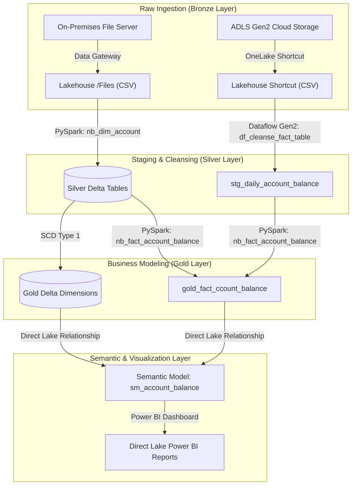

# Bank Data Analytics: Microsoft Fabric Financial Analytics Platform

This repository contains an end-to-end, enterprise-grade cloud data engineering and business intelligence solution built on **Microsoft Fabric**. The project implements a **Medallion Architecture (Bronze → Silver → Gold)** to ingest, clean, transform, and model bank data, serving interactive Power BI analytical dashboards with Direct Lake performance.

---

## 📂 Project Structure

```text
Fabric_Financial_Analytics/
│
├── 📁 data/                           # Local Source CSV Datasets (Banking Star Schema)
│   ├── dim_date.csv                   # Date Dimension
│   ├── dim_customer.csv               # Customer Demographic Dimension
│   ├── dim_branch.csv                 # Branch Locations Dimension
│   ├── dim_product.csv                # Financial Product Catalog (Interest Rates/Fees)
│   ├── dim_account.csv                # Customer Accounts Mapping
│   ├── dim_channel.csv                # Transaction Channel (ATM, Branch, Online, etc.)
│   ├── dim_employee.csv               # Bank Employee Mapping
│   ├── fact_transactions.csv          # Transaction-level Fact Data
│   ├── fact_daily_account_balance.csv # Periodic Snapshot Fact Data (Balances)
│   ├── fact_loan_payments.csv         # Loan Repayment Activity Fact Data
│   └── README_schema.txt              # Standard Star-Schema relationships and metadata
│
├── 📁 pipelines/                      # Orchestration & Ingestion Components
│   ├── 📁 pipeline_json/
│   │   └── pl_ingest_data_to_lh.json  # Orchestration Pipeline definition (JSON export)
│   └── 📁 dataflows/
│       └── PowerQuery.txt             # Dataflow Gen2 Power Query M-code formula
│
├── 📁 scripts/                        # Data Processing & Transformation Compute Layer
│   └── 📁 python/                     # PySpark Notebooks (.ipynb)
│       ├── nb_dim_account.ipynb       # Dimension standardization, cleansing & SCD Type 1 merges
│       └── nb_fact_account_balance.ipynb # Fact left joins, key imputation (-1), and Gold table load
│
├── 📁 reports/                        # Semantic & Visualization Layer
│   ├── AccountsByBranch.pbix          # Power BI report files (.pbix)
│   ├── AccountsByGender.pbix          
│   ├── AccountsByKYC.pbix             
│   ├── AccountsByProductCategories.pbix 
│   ├── CustomerBySegments.pbix        
│   └── *.png                          # Dashboard layout and visual screenshots
│
└── 📁 docs/                           # Project Documentation
    ├── 📁 ProjectDocumentation/
    │   └── Fabric_Financial_Analytics.pdf # Detailed project design document
    └── 📁 images/                     # Architectural images and diagrams
```

---

## 🏗️ Architecture & Data Flow

The project utilizes a **Medallion Architecture** to isolate raw data ingestion from cleansed staging structures and optimized production datasets.



### 1. Ingestion & Connectivity (Bronze Layer)
* **On-Premises Dimensions**: Local CSV files (`dim_customer`, `dim_branch`, `dim_product`, `dim_account`) are transferred securely into Lakehouse `/Files/bankdata-dim` using a **Microsoft Fabric Data Pipeline** executing copy activities through an **On-Premises Data Gateway**.
* **Cloud Transactional Facts**: High-volume transaction facts (`fact_daily_account_balance.csv`) stored in **Azure Data Lake Storage Gen2 (ADLS Gen2)** are surfaced directly inside the Lakehouse `/Files/bankdata-fact` folder via a zero-copy **OneLake Shortcut**, avoiding storage replication costs.

### 2. Staging & Cleansing (Silver Layer)
* **Dimensions Processing**: Standardizes formatting, strips whitespaces, casts data types, and deduplicates dimension structures based on business keys.
* **Fact Cleansing (Dataflow Gen2)**: An orchestration activity triggers the `df_cleanse_fact_table` dataflow, executing the M queries in [PowerQuery.txt]:
  * Dynamic header promotion and data type assignment.
  * Filters out rows with `null` business keys.
  * **Mathematical Validation Constraint**: Implements an accounting check column where `Is_Balance_Valid` evaluates if:
    $$\text{Closing Balance} = \text{Opening Balance} + \text{Credit Amount} - \text{Debit Amount}$$
  * Filters out transaction discrepancies and drops the validation column before saving the clean records to `stg_daily_account_balance` Delta staging table.

### 3. Production Star Schema (Gold Layer)
* **Dimension Table Merges**: Notebook [nb_dim_account.ipynb] uses PySpark to execute **SCD Type 1 (Merge/Upsert)** operations, ensuring historical values are overwritten on matching primary keys and missing dimension values default to defined placeholders (`UNKNOWN`).
* **Referential Integrity Enforcement**: Notebook [nb_fact_account_balance.ipynb] loads dimensions and the staged fact table, executing left outer joins. Using `coalesce`, any unmatched foreign key (orphan transaction) is automatically assigned a default surrogate key of `-1` to ensure dashboard query stability before generating the final table `gold_fact_ccount_balance`.

---

## ⚡ Master Ingestion Pipeline (`pl_ingest_data_to_lh`)

The orchestration pipeline coordinates task execution dynamically:

1. **`Current Date` (Set Variable)**: Instantiates execution parameters.
2. **`copy2adls` (Copy Data)**: Triggers the On-Premises Data Gateway to push dimension files to the Lakehouse folder.
3. **`nb_dim_cleanse` (Notebook Activity)**: Executes the notebook [nb_dim_account.ipynb]to build Delta dimensions.
4. **`Dataflow1` (Dataflow Refresh)**: Processes the cloud fact CSV via Dataflow Gen2 and loads `stg_daily_account_balance`.
5. **`nb_create_gold_fact` (Notebook Activity)**: Triggers the notebook [nb_fact_account_balance.ipynb]to enforce relationships and write to `gold_fact_ccount_balance`.
6. **`Office365Email1` (Email Activity)**: Sends email notifications to administrators on pipeline success or failure.

---

## 📊 Semantic Model & Power BI Reports

The modeling layer defines relationships and calculations optimized for Direct Lake mode (import speeds directly over Delta tables on OneLake without DirectQuery lag).

### Model Relationships:
* `gold_fact_ccount_balance` ($*$) $\rightarrow$ `dim_customer` ($1$) on `customer_key`
* `gold_fact_ccount_balance` ($*$) $\rightarrow$ `dim_account` ($1$) on `account_key`
* `gold_fact_ccount_balance` ($*$) $\rightarrow$ `dim_branch` ($1$) on `branch_key`
* `gold_fact_ccount_balance` ($*$) $\rightarrow$ `dim_product` ($1$) on `product_key`

### Analytical Measures (DAX):
* **Distinct Accounts Volume**:
  ```dax
  Distinct Accounts Count = DISTINCTCOUNT(gold_fact_ccount_balance[account_number])
  ```
* **Total Balance Outstandings**:
  ```dax
  Total Balance = SUM(gold_fact_ccount_balance[current_balance])
  ```

### Exposed BI Assets:
1. **Accounts By Branch**: Displays branch counts and location breakdowns.
2. **Customers By Segment**: Pie charts outlining demographic categorization (e.g., Mass, Affluent, Premium).
3. **Accounts By Product Category**: Illustrates counts across loan and deposit accounts.
4. **Accounts By KYC Status**: Tracks customer verification progress (`VERIFIED`, `PENDING`).
5. **Accounts Count by Gender**: Analyzes demographic distributions alongside top customer balances.

---

## 🛠️ Operations & Troubleshooting Register

Below is the register of encountered deployment issues, root causes, and resolution strategies:

| Issue ID | Component | Error Message / Symptom | Root Cause | Resolution Strategy |
| :--- | :--- | :--- | :--- | :--- |
| **ERR-001** | Connectivity / Shortcut | `Connection of kind AzureDataLakeStorage using AuthKind WorkspaceIdentity did not have accessToken specified.` | The workspace identity principal has not been initialized. | Navigate to **Workspace Settings** $\rightarrow$ **Workspace Identity** and explicitly enable/create it. |
| **ERR-002** | Azure Storage / IAM | `Error 403 - This request is not authorized to perform this operation using this permission.` | The Workspace Managed Identity lacks data-plane access to the ADLS Gen2 container. | In the Azure Portal storage account settings, navigate to **Access Control (IAM)** and assign **Storage Blob Data Reader** or **Storage Blob Data Contributor** to your Fabric Workspace Identity. |
| **ERR-003** | Storage Networking | Shortcut fails to connect or returns timeout errors. | The storage firewall is active and blocks Fabric's internal compute engines. | In the storage account **Networking** tab, check *"Allow trusted Azure services to access this storage account"* and configure a **Resource Instance Rule** targeting Microsoft.DataFactory workspaces. |
| **ERR-004** | Pipeline Notifications | `{"error":{"code":"MailboxNotEnabledForRESTAPI","message":"The mailbox is either inactive or hosted on-premise."}}` | The Office 365 Outlook activity requires a cloud-hosted Exchange Online mailbox, failing on local/hybrid configurations. | Migrate the service account mailbox to Exchange Online (with license) or replace the notification block with a Microsoft Teams pipeline channel activity. |

---

## 🚀 Deployment Steps

1. **Configure Data Gateway**: Register the On-Premises Data Gateway to map local folder access for dimension CSV paths.
2. **Create Lakehouse Shortcuts**: Set up an Azure Data Lake Storage Gen2 shortcut named `bankdata-fact` pointing to your transaction logs container.
3. **Deploy Pipelines & Dataflows**: Import the JSON definitions in `pipelines/` and configure the connection targets.
4. **Publish PySpark Notebooks**: Import the notebooks inside `scripts/python/` into the Fabric Workspace.
5. **Configure Power BI Connection**: Open `.pbix` reports from the `reports/` folder, edit the source settings to direct queries to your custom SQL Endpoint / Semantic Model, and publish to the Workspace.
