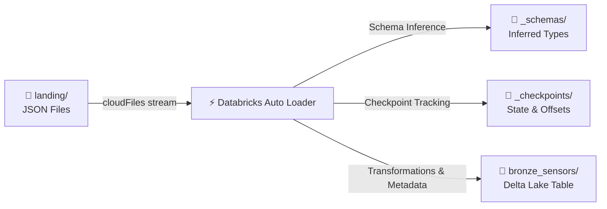

# 🚀 Azure Databricks Auto Loader Proof of Concept (POC)

This directory serves as a self-contained **Proof of Concept (POC)** demonstrating the capabilities of **Databricks Auto Loader (`cloudFiles`)** for incremental, high-throughput ingestion of files into a managed **Delta Lake** bronze table.

Auto Loader dynamically detects the arrival of new files in the designated landing zone and ingests them with **exactly-once semantics**, schema inference, schema rescue capability, and failure recovery.

---

## 📂 POC Directory Structure

This folder contains the actual physical files and directories generated during the execution of the Auto Loader stream:

```text
autoloader_poc/
│
├── 📁 landing/                # Source directory representing the cloud landing zone (e.g. ADLS Gen2 container)
│   └── 📄 batch_1.json        # Sample JSON batch containing raw IoT sensor events
│
├── 📁 _schemas/               # Schema directory where Auto Loader persists inferred schemas
│   └── 📁 bronze/
│       └── 📁 _schemas/
│           └── 📄 0           # Auto Loader schema inference metadata file
│
├── 📁 _checkpoints/           # Checkpoint directory for Spark Structured Streaming state tracking
│   └── 📁 bronze/
│       ├── 📁 offsets/        # Streaming offsets metadata (tracks files processed)
│       ├── 📁 commits/        # Commits metadata (records completed micro-batches)
│       └── 📁 sources/        # Source directory tracking information
│
└── 📁 bronze_sensors/         # Target Delta Table representing the Bronze layer storage
    └── 📁 _delta_log/         # Transaction logs storing Delta commit history & metadata
        └── 📄 00000000000000000000.json
```

---

## 🏗️ Architecture & Data Flow



### 1. Ingestion Source (`landing/`)
Files land in the source directory (simulating an external data lake path). In this POC, `batch_1.json` is landed containing record lines with the following structure:
```json
{"device_id": "DEV_101", "temp": 21.5, "timestamp": "2026-07-21 10:00:00"}
{"device_id": "DEV_102", "temp": 22.1, "timestamp": "2026-07-21 10:00:05"}
```

### 2. Schema Inference & Persistence (`_schemas/`)
* **Auto Loader Schema Detection**: The engine reads the source files, infers data types, and caches them in the metadata schema file (`_schemas/bronze/_schemas/0`).
* **Inferred Schema**:
  * `device_id`: `string`
  * `temp`: `double`
  * `timestamp`: `string`

### 3. Checkpoint Tracking (`_checkpoints/`)
* Structured Streaming checkpoints guarantee **exactly-once processing** by saving query progress (metadata, offsets, and sources) to storage. If the stream stops or the cluster restarts, it picks up exactly where it left off, avoiding duplicate ingestion.

### 4. Target Delta Table (`bronze_sensors/`)
The final data is loaded into the `bronze_sensors` Delta table with additional audit and rescue columns.
* **Rescued Data Column (`_rescued_data`)**: Captures any unexpected fields, schema mismatches, or malformed data dynamically to ensure zero data loss.
* **Audit Columns**: `ingested_at` (runtime timestamp) and `source_file` (origin file name) are appended to preserve lineage.

---

## 📋 Schema Definition

The table below contrasts the structure inferred from the source files against the schema committed to the target `bronze_sensors` Delta table:

| Column Name | Inferred Type | Delta Table Type | Description |
| :--- | :--- | :--- | :--- |
| **`device_id`** | `string` | `string` | Unique identifier of the IoT sensor device. |
| **`temp`** | `double` | `string` | Measured temperature. *Note: Cast to string in the Bronze layer to preserve raw representation.* |
| **`timestamp`** | `string` | `string` | Original event timestamp from the sensor. |
| **`_rescued_data`** | *N/A* | `string` | JSON string containing data rescued during schema drift or mismatch. |
| **`ingested_at`** | *N/A* | `timestamp` | Audit timestamp tracking when Spark processed the record. |
| **`source_file`** | *N/A* | `string` | Absolute path of the raw source file ingested. |

---

## 💻 Code Reference: PySpark Implementation

To replicate or run this Auto Loader stream in a Databricks Notebook, execute the following PySpark code:

```python
from pyspark.sql.functions import current_timestamp, input_file_name

# 1. Define folder paths (Update paths according to DBFS/ADLS mount locations)
source_landing_dir = "/Workspace/Users/bsravya4@gmail.com/autoloader_poc/landing"
schema_location = "/Workspace/Users/bsravya4@gmail.com/autoloader_poc/_schemas/bronze"
checkpoint_location = "/Workspace/Users/bsravya4@gmail.com/autoloader_poc/_checkpoints/bronze"
target_delta_dir = "/Workspace/Users/bsravya4@gmail.com/autoloader_poc/bronze_sensors"

# 2. Configure Auto Loader Stream Reader
df_stream = (spark.readStream
    .format("cloudFiles")
    .option("cloudFiles.format", "json")
    .option("cloudFiles.schemaLocation", schema_location)
    .option("cloudFiles.inferColumnTypes", "true")
    .load(source_landing_dir)
)

# 3. Add Lineage and Ingestion Audit Columns
df_enriched = (df_stream
    .withColumn("ingested_at", current_timestamp())
    .withColumn("source_file", input_file_name())
)

# 4. Write Stream to Delta Table
query = (df_enriched.writeStream
    .format("delta")
    .option("checkpointLocation", checkpoint_location)
    .outputMode("append")
    .start(target_delta_dir)
)
```

---

## 🌟 Key Auto Loader Features Demonstrated in this POC

1. **Automatic Schema Inference**: Dynamically determines column types without manual DDL definition, storing the schema state in `_schemas/`.
2. **Schema Drift & Rescued Data**: Prevents processing crashes when payload formats change. Any unmatched data type or extra column is stored in `_rescued_data`.
3. **Optimized File Notification/Queueing**: Can scale from local directory listing (used here) to cloud notifications (SQS/SNS, Azure Event Grid, or GCP Pub/Sub) for massive scales.
4. **Exactly-Once Semantics**: Maintained via write-ahead logs and commits in `_checkpoints/`.
