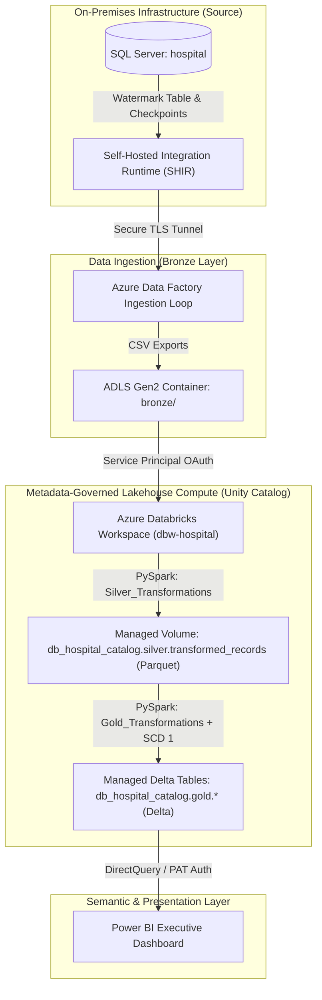

# End-to-End Healthcare ETL Pipeline: Azure Data Factory, Databricks, and Delta Lake

This repository contains an end-to-end, enterprise-grade, hybrid cloud data engineering and analytics solution built on the **Azure Data Platform**. The platform integrates legacy on-premises SQL Server data with a modern cloud data lakehouse using a metadata-driven incremental ingestion pipeline and a strict **Medallion Architecture (Raw/Bronze → Silver → Gold)** governed by **Unity Catalog**. Interactive reporting is enabled via a **Power BI** semantic model using DirectQuery.

---

## 📂 Project Structure

```text
databricks_health_analytics/
│
├── 📁 data/                           # Local Metadata and Star Schema Schemas
│
├── 📁 docs/                           # Project Documentation
│   └── 📁 ProjectDocumentation/
│       └── HealthcareAnalytics_Documentation.pdf # Detailed architecture & system specifications
│
├── 📁 pipelines/                      # Orchestration & Ingestion Components
│   └── 📁 pipeline_json/
│       └── pl_master_hospital.json    # Azure Data Factory Master Orchestrator Pipeline (JSON export)
│
├── 📁 scripts/                        # Data Processing & Transformation Compute Layer
│   ├── 📁 SQL/                        # SQL Infrastructure Setup Scripts
│   │   ├── watermark_setup.sql        # Source SQL DB watermark table & checkpoint stored procedure DDL
│   │   └── unity_catalog_setup.sql    # Unity Catalog catalog, schema, volume & privilege grants DDL
│   │
│   └── 📁 python/                     # Databricks PySpark Notebooks (.py source exports)
│       ├── Silver_Transformations.py  # Bronze-to-Silver cleansing, schema alignment & date-truncation
│       ├── Gold_Transformations.py    # Silver-to-Gold feature engineering, aggregations & SCD Type 1 merges
│       └── Gold_Insights.py           # Gold analytical validation queries and reporting previews
│
└── 📁 reports/                        # Visual Reports & Dashboards Layout
```

---

## 🏗️ Architecture & Data Flow

The platform implements a security-hardened, governed, and highly optimized data flow spanning on-premises servers to cloud serving layers:



### 1. Ingestion & Connectivity (Bronze Layer)
* **On-Premises Seeding**: Legacy relational transaction tables (`hospitals`, `physicians`, `patients`, `departments`, `encounters`) are hosted on-premises in a database called `hospital`.
* **Metadata-Driven Watermarking**: A central watermark state table (`dbo.watermark_table`) records the last processed boundary for each clinical table. The ADF pipeline dynamically queries this table to execute performant delta reads instead of heavy full-table scans.
* **Network Gateway Bridge**: A **Self-Hosted Integration Runtime (SHIR)** establishes a secure outbound-only connection tunnel (Port 443) from the on-premises database to Azure Data Factory, abstracting firewalls and VPNs.
* **Bronze Landing**: ADF copies incremental slices of SQL data into flat CSV files stored within the `bronze` container of an **Azure Data Lake Storage Gen2 (ADLS Gen2)** account (`azrtlslsgen2`). The directories are structured dynamically by timestamp: `bronze/{folder_name}/{yyyy/MM/dd/HH/mm}/{table_name}.csv`.

### 2. Staging & Metadata Governance (Silver Layer)
* **Security & Authorization**: Credentials are fully abstracted. Databricks accesses the Key Vault resource `kv-hospital-secrets-prod` using a secret scope (`hospital-scope`) to retrieve a Service Principal's client secret token, mounting the storage account via OAuth 2.0.
* **Cleansing & Conformity**: The notebook [Silver_Transformations.py](file:///C:/Git/AzureDataEngineering/databricks_health_analytics/scripts/python/Silver_Transformations.py) reads raw CSV files, enforces schemas, renames columns to a uniform snake_case naming style, and deduplicates records.
* **Legacy Parsing Strategy**: Implements defensive timestamp parsing by standardizing datetime strings to a standard 19-character limit (`yyyy-MM-dd HH:mm:ss`) to bypass microsecond and fractional sub-second padding inconsistencies exported by SQL Server.
* **Volume Storage**: Cleansed staging data is written as compressed Parquet files to a Unity Catalog Managed Volume: `/Volumes/db_hospital_catalog/silver/transformed_records/`.

### 3. Business Aggregations & Presentation (Gold Layer)
* **SCD Type 1 Delta Merges**: The notebook [Gold_Transformations.py](file:///C:/Git/AzureDataEngineering/databricks_health_analytics/scripts/python/Gold_Transformations.py) reads the Parquet staging datasets and implements a **Slowly Changing Dimension (SCD) Type 1** strategy. Using high-performance Delta Table `MERGE` commands, matching primary keys are updated in-place, while new records are appended.
* **Clinical Feature Engineering**:
  * `actual_stay_days`: Computes the duration between admission and discharge dates. Caps minimum stay to `1` day to account for same-day discharges.
  * Financial Metrics: Estimates billable revenue (`total_charge`) using a standard billing rate of **$1,200/day** and operational overhead (`operational_cost`) modeled at **$750/day + $500 flat fee**.
  * Age Cohorts: Calculates `current_age` dynamically, routing missing or dummy dates (`1900-01-01`) safely to `null` to establish demographic cohorts (`Pediatric` <18, `Adult` 18-64, `Geriatric` >=65).
  * Rolling Densities: Computes `zipcode_hospitals_total` and provider-level encounter volumes (`provider_encounters_total`).

---

## ⚡ Master Ingestion Pipeline (`pl_master_hospital`)

The Azure Data Factory pipeline orchestrates processing in a modular, control-flow topology:

1. **`set_Execution_Timestamp` (Set Variable)**: Captures the runtime execution trigger window to build dynamic dated folder paths.
2. **`lkp_get_table_watermark` (Lookup)**: Queries the source watermark metadata tracking table.
3. **`fe_table_items` (ForEach Loop)**: Processes target clinical tables sequentially:
   * **`lkp_item_table` (Lookup)**: Executes a dynamic query on the source SQL table to find the current maximum watermark value.
   * **`cp_item_table` (Copy Data)**: Queries the source SQL database for rows where the watermark column is greater than the last processed checkpoint and less than or equal to the maximum watermark value. Exports the results to ADLS Gen2.
   * **`sp_update_watermark` (Stored Procedure)**: Invokes the administrative stored procedure `dbo.usp_update_watermark_table` to update the watermark table with the new upper-bound checkpoint value.
4. **`nb_Silver_Transformations` (Notebook Activity)**: Spins up the Databricks cluster to run the silver cleansing notebook, passing the folder timestamp as a parameter.
5. **`Orchestrate_Gold_Aggregations` (Notebook Activity)**: Automatically runs the gold transformations notebook upon successful completion of the Silver stage.

---

## 📊 Semantic Modeling & Power BI Dashboards

The semantic layer is established by connecting Power BI directly to the Databricks SQL Warehouse via personal access tokens (PAT) in **DirectQuery** mode.

### Schema Relationships:
* `gold.encounters_summary` ($*$) $\rightarrow$ `gold.patients_demographics` ($1$) on `patient_id` (Cross-filter: Single)
* `gold.encounters_summary` ($*$) $\rightarrow$ `gold.physicians_directory` ($1$) on `provider_id` (Cross-filter: Single)

### Dashboard Visualizations:
1. **Inpatient with the Longest Hospital Stay**: Card visual using a Top 1 filter on `patient_name` sorted descending by `actual_stay_days`.
2. **Patient with the Highest Financial Billing Footprint**: Card visual using a Top 1 filter on `patient_name` sorted descending by the sum of `total_charge`.
3. **Healthcare Provider with the Most Active Encounters**: Horizontal bar chart sorted descending by `provider_encounters_total`.
4. **City with the Highest Enterprise Asset Density**: Treemap/Donut chart illustrating hospital counts grouped by `city` using distinct counts of `hospital_id`.

---

## 🛠️ Operations & Troubleshooting Register

The following register details the core engineering issues identified during system deployment and their resolutions:

| Issue ID | Component | Error / Symptom | Root Cause | Resolution Strategy |
| :--- | :--- | :--- | :--- | :--- |
| **ERR-001** | Unity Catalog / Credentials | Storage credential creation throws a cross-resource authorization error: Managed Identity unrecognized. | The workspace path supplied in Unity Catalog target credential config used an incorrect manual format. | Captured the exact Azure Resource ID string of the workspace's native Access Connector (`mi-databricks-uc-handshake`) and re-executed `CREATE STORAGE CREDENTIAL` using this precise path, granting it `Storage Blob Data Contributor` on ADLS Gen2. |
| **ERR-002** | Unity Catalog / Storage | ADF notebook activity fails with `SecurityException: Permission denied` writing to `transformed_records` volume. | Zero-trust default catalog policies blocked writes because the ADF Orchestrator identity was never granted explicit volume access. | Launched an administrative SQL notebook in Databricks and executed explicit SQL grants: `GRANT USE CATALOG`, `GRANT USE SCHEMA`, and `GRANT READ VOLUME, WRITE VOLUME` to the orchestrator principal. |
| **ERR-003** | Databricks / Spark Engine | PySpark notebook crashes with an `Unparseable Date` runtime exception (SQLSTATE: 22007). | Source SQL Server exported inconsistent date formats with varying fractional sub-second padding (e.g., `.1234567`). | Injected Spark config `spark.conf.set("spark.sql.legacy.timeParserPolicy", "LEGACY")` and applied string truncation `substring(col("Patient Admission Datetime"), 1, 19)` to standardize date strings before casting. |
| **ERR-004** | Data Factory / Databricks | ADF notebook activity fails instantly with workspace connectivity/launch rejection errors. | The ADF Managed Identity (`azadfrtlsls`) was missing IAM role assignments at the Databricks Workspace resource level. | Assigned the standard **Contributor** role to the ADF Managed Identity on the Azure Databricks workspace resource page inside the Azure Portal. |
| **ERR-005** | Hybrid Gateway / SHIR | ADF Copy activity times out or disconnects from the local database during large table extractions. | The local server hosting the SHIR gateway had concurrent threads restricted, and the firewall closed idle ports. | Opened outbound Port 443 in the local corporate network firewall and configured the SHIR Integration Runtime Configuration Manager thread limit from 2 to 4. |
